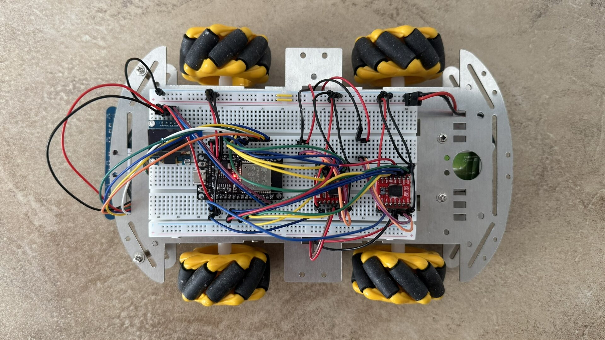
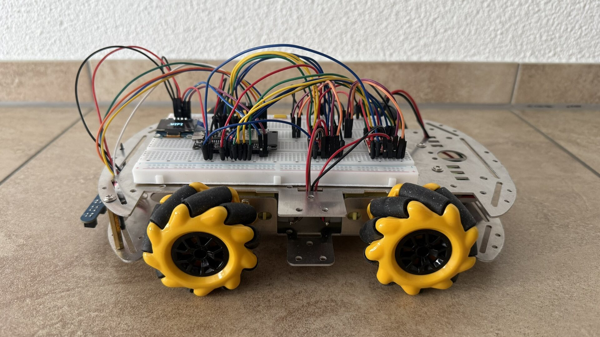
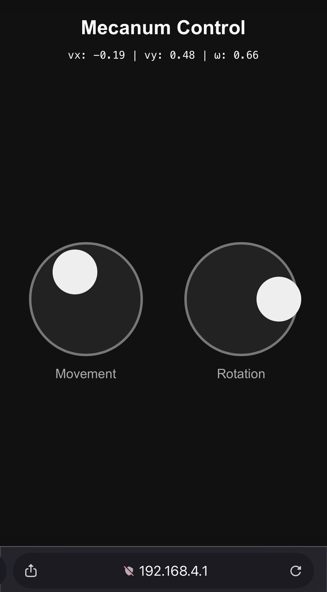
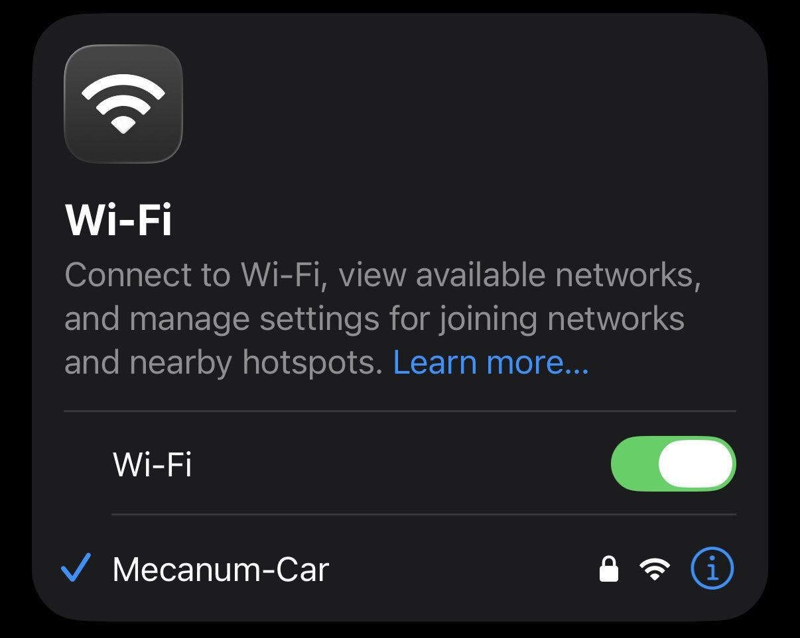
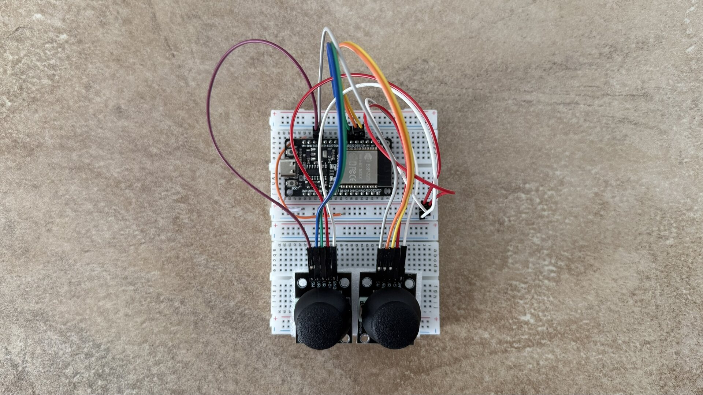

# ESP32 Mecanum Car

This project is a four-wheel Mecanum robot based on two ESP32 applications. The vehicle can be driven from a browser over Wi-Fi, controlled by a separate ESP-NOW handheld controller, or operated autonomously with a five-channel infrared line sensor and a PID controller. A small OLED display shows the active operating mode.

The firmware is the next stage of the [PID-Controlled Mecanum Line Follower](https://github.com/leandro-3rne/pid-line-follower-rc), extending the original line-following prototype with independent wheel control, wireless driving, and mode switching.

<p align="center">
  
  
</p>

---

## 📂 Project Overview

The repository contains two ESP-IDF applications:

1. **Vehicle firmware (`/`)**
   Controls the four motors, the Wi-Fi web server, the ESP-NOW receiver, the line-following controller, the OLED display, and the safety watchdog.

2. **Handheld controller (`mecanum-car-remote/`)**
   Reads analog joystick axes with a second ESP32 and sends normalized movement commands to the vehicle over ESP-NOW.

The vehicle starts in Wi-Fi mode. The BOOT button cycles through the three available modes:

```text
WIFI  ──▶  REMOTE  ──▶  LINE-IR  ──▶  WIFI
```

---

## ⚙️ System Overview

| Feature              | Implementation                                      |
| -------------------- | --------------------------------------------------- |
| Vehicle controller   | ESP32                                               |
| Handheld controller  | ESP32                                               |
| Drivetrain           | 4× DC geared motors with Mecanum wheels            |
| Motor drivers        | TB6612FNG-style dual-channel H-bridge drivers       |
| Line sensor          | 5-channel analog infrared sensor array              |
| Display              | 128×64 I²C OLED, address `0x3C`                    |
| Wireless control     | Wi-Fi access point + HTTP and ESP-NOW               |
| Firmware             | C with ESP-IDF                                      |
| Safety mechanism     | 300 ms command timeout                              |

---

## 🎥 Demonstrations

The repository includes recordings of the three main workflows:

* [Browser controller demo](assets/browser-remote-test.mp4)
* [ESP-NOW remote demo](assets/remote-test.mp4)
* [PID line-following demo](assets/pid-line-following.mp4)

---

## 🛠️ Getting Started

### Prerequisites

* ESP-IDF with support for the ESP32 target
* Two ESP32 boards for using both vehicle and remote firmware
* A USB data cable and the appropriate serial port
* A five-channel analog IR sensor array for line-following mode

The included `.devcontainer` configuration provides an ESP-IDF development environment. Alternatively, run the commands below from an ESP-IDF shell.

### Build and flash the vehicle

```bash
cd mecanum-car
idf.py set-target esp32
idf.py build
idf.py -p /dev/ttyUSB0 flash monitor
```

Replace `/dev/ttyUSB0` with the serial port of the vehicle ESP32.

### Build and flash the handheld controller

```bash
cd mecanum-car-remote
idf.py set-target esp32
idf.py build
idf.py -p /dev/ttyUSB1 flash monitor
```

Replace `/dev/ttyUSB1` with the serial port of the controller ESP32.

### ESP-NOW pairing

The handheld controller sends to the vehicle MAC address defined in `mecanum-car-remote/main/remote_control.c`:

```c
static const uint8_t mecanum_mac[6] = {
    0xB4, 0xBF, 0xE9,
    0xC8, 0x70, 0x48
};
```

If the vehicle board changes, replace this address with the MAC address of the vehicle ESP32. Both devices use Wi-Fi channel `1`.

---

## 🎮 Operating Modes

### Wi-Fi browser control

Wi-Fi mode starts an access point with the following defaults:

| Setting  | Value          |
| -------- | -------------- |
| SSID     | `Mecanum-Car`  |
| Password | `12345678`     |
| Address  | `192.168.4.1`  |

1. Connect a phone or computer to the `Mecanum-Car` network.
2. Open `http://192.168.4.1` in a browser.
3. Use the left joystick for movement and the right joystick for rotation.

The browser sends normalized velocity commands to `/drive` every 50 ms:

```text
/drive?vx=<sideways>&vy=<forward>&omega=<rotation>
```

The browser controller and the Wi-Fi setup are also included as images in [`assets/`](assets/).

<p align="center">
  
  
</p>

### ESP-NOW remote control

The handheld controller reads three analog axes:

* Movement X → sideways velocity `vx`
* Movement Y → forward velocity `vy`
* Rotation X → angular velocity `omega`

Commands are sent as three 32-bit floating-point values. Releasing the joystick returns the corresponding value to zero. The vehicle safety task stops the motors if commands stop arriving.

<p align="center">
  
</p>

### Autonomous line following

Line-following mode uses the five analog IR sensors to estimate the line position and steer the vehicle with a PID controller.

When this mode starts, the vehicle samples the bright floor for white-surface calibration. Keep the sensors over the intended background during this short calibration phase. If the line is not visible for 0.5 seconds, the robot stops until the line is detected again.

---

## 🛞 Mecanum Kinematics

The browser and handheld controller use normalized velocity commands:

* `vx` — sideways movement
* `vy` — forward/backward movement
* `omega` — rotation

The vehicle converts these commands into four wheel speeds:

$$
v_{FR} = v_y + v_x - \omega
$$

$$
v_{FL} = v_y + v_x + \omega
$$

$$
v_{RR} = v_y - v_x - \omega
$$

$$
v_{RL} = v_y - v_x + \omega
$$

Each motor command is clamped to the range `[-1, 1]`. With independent wheel control, the robot can drive forward, sideways, diagonally, and rotate on the spot.

---

## 👁️ Line Detection and PID Control

### Sensor position

The five sensors are assigned positional weights from `IR1` to `IR5`:

```text
Sensor:  IR1    IR2    IR3    IR4    IR5
Weight: +2.5   +1.0    0.0   -1.0   -2.5
```

The raw values are normalized using per-sensor black and white calibration values:

$$
s_i = \operatorname{clamp}\left(
\frac{w_i-r_i}{w_i-b_i},
0,1\right)
$$

where:

* $r_i$ is the raw sensor value,
* $b_i$ is the black-line reference,
* $w_i$ is the calibrated white-surface reference,
* $s_i$ is the normalized line intensity.

The weighted line position is then calculated as:

$$
p = \frac{\sum_{i=1}^{5} q_i s_i}{\sum_{i=1}^{5} s_i}
$$

The target position is the center of the sensor array:

$$
p_{target}=0
$$

The tracking error is converted into a rotational command by the discrete PID controller:

$$
\omega = \operatorname{clamp}\left(
K_Pe + K_I\int e\,dt + K_D\frac{de}{dt},
-1,1\right)
$$

The current firmware uses:

| Parameter                 | Value |
| ------------------------- | ----- |
| $K_P$                     | `0.85` |
| $K_I$                     | `0.05` |
| $K_D$                     | `0.50` |
| Base speed                | `0.40` |
| PID update period         | `20 ms` |
| Line-lost stop delay      | `0.5 s` |

The integral term is limited to prevent wind-up, and it is reset when the line is no longer visible.

---

## 🔌 Pin Configuration

### Vehicle ESP32

| Function       | GPIO / channel |
| -------------- | -------------- |
| Front-right IN1 / IN2 | `13` / `33` |
| Front-right PWM | `14` |
| Front-left IN1 / IN2  | `25` / `26` |
| Front-left PWM  | `27` |
| Rear-right IN1 / IN2  | `16` / `17` |
| Rear-right PWM  | `5` |
| Rear-left IN1 / IN2   | `18` / `19` |
| Rear-left PWM   | `21` |
| Motor driver STBY | `4` |
| BOOT / mode button | `0` |
| OLED SDA / SCL | `23` / `22` |

### Line sensor array

| Sensor | GPIO | ADC channel |
| ------ | ---- | ----------- |
| IR1 | `36` | `ADC1_CHANNEL_0` |
| IR2 | `39` | `ADC1_CHANNEL_3` |
| IR3 | `34` | `ADC1_CHANNEL_6` |
| IR4 | `35` | `ADC1_CHANNEL_7` |
| IR5 | `32` | `ADC1_CHANNEL_4` |

### Handheld controller ESP32

| Input        | GPIO | ADC channel |
| ------------ | ---- | ----------- |
| Movement X   | `32` | `ADC1_CHANNEL_5` |
| Movement Y   | `33` | `ADC1_CHANNEL_4` |
| Rotation X   | `34` | `ADC1_CHANNEL_7` |

---

## 🛡️ Safety

Every valid Wi-Fi, ESP-NOW, or line-following command refreshes the safety timer. If no command is received for 300 ms, the vehicle:

1. Sets all wheel speeds to zero.
2. Disables the motor-driver standby output.

The browser also sends a zero command when the page is closed or hidden, but the watchdog remains the final stop mechanism if the connection is interrupted unexpectedly.

---

## 📁 Repository Layout

```text
.
├── main/                    # Vehicle firmware
│   ├── controller.html      # Embedded Wi-Fi joystick UI
│   ├── line_follow.c       # IR sampling and PID controller
│   ├── motor.c              # Four-wheel Mecanum control
│   ├── remote_control.c    # ESP-NOW receiver
│   ├── safety.c             # Command watchdog
│   └── wifi_control.c      # Access point and HTTP API
├── mecanum-car-remote/     # Separate ESP-NOW joystick firmware
├── assets/                  # Project photos and demonstration videos
├── CMakeLists.txt
└── README.md
```

---

## 📄 License

This project is licensed under the MIT License. See [`LICENSE`](LICENSE) for the full license text.
